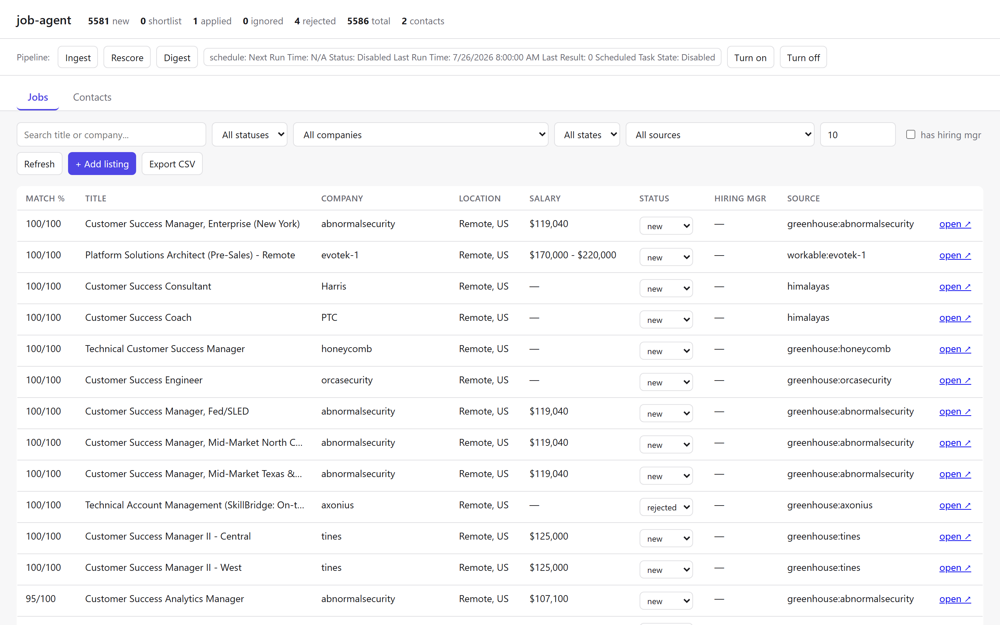
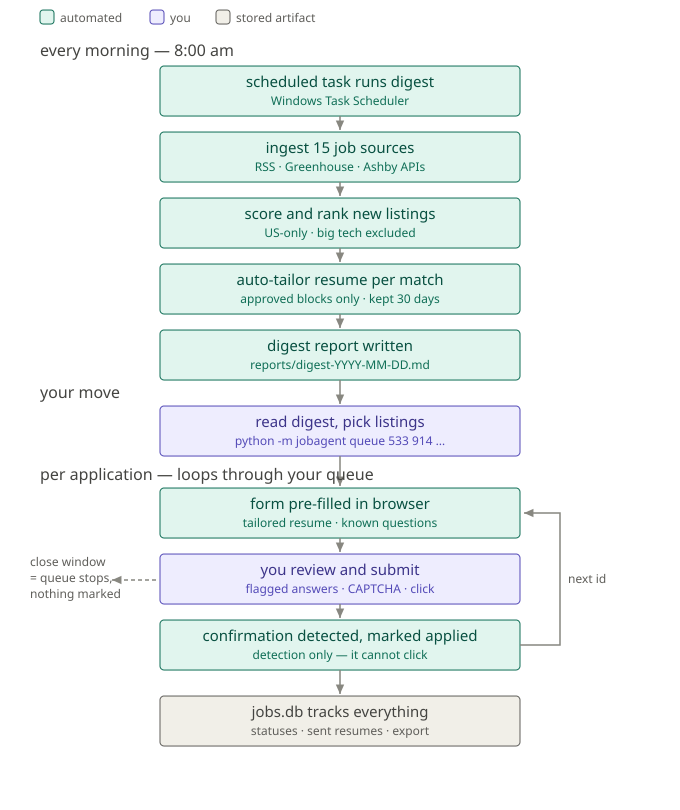

# job-agent

[](https://github.com/michaeldinhmai/job-agent/actions/workflows/ci.yml)
[](https://github.com/michaeldinhmai/job-agent/actions/workflows/codeql.yml)
[](LICENSE)

**Eleven job-source integrations normalized into one schema, with a human in
the loop before anything goes out.**

Discovery pulls from eight ATS APIs — Greenhouse, Lever, Ashby, Workday,
SmartRecruiters, Recruitee, Workable and Comeet — plus RSS feeds, RemoteOK
and Himalayas. Every response is normalized into one record shape
(`title, department, location, remote, salary, posted_at, apply_url, …`),
ranked against rules you define, and used to tailor a resume per listing and
pre-fill the application form. Four of those platforms (Greenhouse, Ashby,
Workday, iCIMS) also have browser adapters for the apply step.

**A human reviews and submits every application.** That boundary is
deliberate design, not a missing feature — an application goes out under a
real name.

<picture>
  <source media="(prefers-color-scheme: dark)" srcset="docs/dashboard-dark.png">
  
</picture>

The local dashboard: every listing ranked and explainable, salary parsed out
of the description text, location normalized across sources, and the
originating ATS shown per row. Everything specific to *you* — search targets,
resume content, contact info — lives in gitignored local files
(see [Configuration](#configuration)); the code and `.example.json` templates
are the reusable part.



Teal = automated · purple = manual (open [docs/flow.svg](docs/flow.svg) in any
browser if your editor doesn't preview images). The purple boxes are
deliberate design, not gaps: an application goes out under a real name, so a
human reads every one before it does.

## Quickstart

```bash
python -m venv .venv && .venv\Scripts\activate
pip install -r requirements.txt && playwright install chromium

# Set up your own local config — these three files are gitignored and never pushed.
cp config.example.json config.json       # your search targets, keywords, sources
cp profile.example.json profile.json     # your name/contact/resume path
cp variants.example.json variants.json   # your resume's tailoring building blocks
# Edit all three (see Configuration below), then:

python -m jobagent ingest          # pull all sources into jobs.db
python -m jobagent list            # ranked matches
python -m jobagent apply 533       # pre-fill an application (you submit)
python -m jobagent.webapp          # local dashboard at http://127.0.0.1:5151
```

## Daily workflow

1. The **"job-agent daily digest"** scheduled task (8:00 AM) ingests all
   sources, auto-tailors a resume for each new match, and writes
   `reports/digest-YYYY-MM-DD.md` with ready-to-run commands.
2. Pick ids from the digest (or `python -m jobagent list`).
3. `python -m jobagent queue 533 914 223` — one browser window; each form
   arrives pre-filled, you finish the flagged items, pass the reCAPTCHA, and
   click Submit. The next form loads automatically.
4. Submissions are detected and marked `applied` in the DB — no bookkeeping.

## Command reference

All via `python -m jobagent <command>`:

| Command | What it does |
|---|---|
| `ingest [--source X]` | Fetch listings from configured sources into `jobs.db` |
| `digest` | Ingest + auto-tailor new matches + write the daily report (used by the scheduled task) |
| `schedule on\|off\|status` | The automation switch: enable/disable the 8 AM task, or see next/last run |
| `list [--min-score N] [--status S]` | Ranked matches, each with a `why:` score explanation |
| `show <id>` / `open <id>` | Full listing detail / open in browser |
| `apply <id-or-url>` | Pre-fill one application (auto-routes to the right ATS adapter) |
| `queue <ids...>` | Chain applications; mixed ATSes group automatically |
| `mark <id> <status>` | new / shortlist / applied / ignored / rejected |
| `tailor <id>` | Gap-report: which JD terms your resume shows / misses |
| `rescore` | Re-apply config.json rules without re-fetching |
| `export [--out f.csv]` | Dump matches to CSV |
| `find-hm <id>` | Build hiring-manager search templates (Google X-ray, LinkedIn) for one listing |
| `delete <id>` | Permanently delete a listing (`-y` to skip confirmation) |
| `contact add\|list\|show\|update\|delete` | Track networking contacts — separate from the applied/rejected lifecycle on `jobs` |

Adapter-specific (login flows, experimental ATSes):
`python -m jobagent.workday login <url>` · `python -m jobagent.icims login <url>`
· `python -m jobagent.autotailor generate <id> | batch | purge`

## Configuration

Three files, all in the repo root, all gitignored (your copies stay local —
only the `.example.json` templates are tracked):

- **config.json** (from [config.example.json](config.example.json)) — what to
  search for: title include/exclude lists, weighted keywords (negative
  weights demote, e.g. `"senior": -3`), company excludes, US-only location
  policy, sources (RSS feeds + Greenhouse/Lever/Ashby/Workday/SmartRecruiters/
  Recruitee/Workable boards), and
  two optional sections — `role_families` (career-track taxonomy for the
  `find-hm` search-keyword picker) and `resume_analysis.vocab` (field-specific
  terms the tailor gap-report flags even on a single mention). Both fall back
  to a packaged presales/technical-account-management default if omitted —
  see `DEFAULT_ROLE_FAMILIES` in `jobagent/cli.py` and `DEFAULT_VOCAB` in
  `jobagent/resume.py`. Comments in the file explain each knob. After
  editing: `python -m jobagent rescore`.
- **profile.json** (from [profile.example.json](profile.example.json)) —
  your standard application answers: name, contact, LinkedIn, work
  authorization, sponsorship, base resume path. **Never passwords** — logins
  happen in a real browser, only session cookies persist (`auth/`,
  git-ignored).
- **variants.json** (from [variants.example.json](variants.example.json)) —
  approved building blocks for the auto-tailor. Nothing goes on a generated
  resume that isn't in your base resume or approved here.

### Scoring model (matcher.py)

Title hit +10 · US location +3 · keyword in title = full weight · keyword in
description = +1 capped at +4 (so keyword-stuffed postings can't dominate) ·
word-boundary matching ("intern" doesn't reject "International Solutions
Engineer") · rejects are explained (`excluded title:`, `not US:`, ...).

### US-only classifier (locations.py)

Positive-signal-first: state names, `, XX` abbreviations, bare US cities,
accent-folded foreign cities. "Remote - US and Canada" stays; "Remote -
United Kingdom" goes; "Remote or Hybrid" is unknown (kept by default —
`unknown_ok` in config). Run `python test_locations.py` after touching it.

## Auto-tailored resumes (autotailor.py)

For each new match the digest classifies the JD into a domain — security /
observability / data / ai / devtools — and produces
`resume/tailored/<id>_<company>.docx` with CORE COMPETENCIES reordered to
lead with what that JD cares about. The path is recorded on the listing and
adapters attach it automatically (`--resume` overrides).

- **Assembly, not authorship**: the tailor only rearranges base-resume
  content and inserts variants.json blocks you've approved. If you're using
  an AI assistant to help draft new wording, review and approve it yourself
  before it enters the pool — the tool never invents claims on its own.
- **Retention**: 30 days, purged by the digest — except resumes for
  `applied` listings, kept forever as the record of what was sent.

## ATS adapters

Shared machinery lives in [applyflow.py](jobagent/applyflow.py); each adapter
contributes only its ATS-specific parts (form discovery, field ids, quirks).
All adapters share the same contract:

> Fill what maps confidently, report everything (`NEEDS YOU` = yours),
> never touch EEO/demographic questions, and **never click Submit**. After
> you submit, the confirmation page is detected and the listing marked
> applied — detection only; a confirmation can only exist because you
> clicked.

| Adapter | Login | Status | Quirks handled |
|---|---|---|---|
| [greenhouse.py](jobagent/greenhouse.py) | none | verified live | hosted page vs `/embed/job_app` fallback (Axonius/Cribl disable hosting); React hydration wiping filled fields (read-back + re-fill); country name differences (prefix fallback) |
| [ashby.py](jobagent/ashby.py) | none | verified live | yes/no questions are hidden checkboxes driven by sibling Yes/No buttons — an explicit "No" is clicked, never left blank; custom dropdowns reported |
| [workday.py](jobagent/workday.py) | per-tenant account | parked | `data-automation-id` selectors; `total` only on first page of CXS API |
| [icims.py](jobagent/icims.py) | per-portal account | experimental | nested `icims_content_iframe`; tenant-customized wizards — expect to finish more fields yourself; report misses so it learns |

Login flows (Workday/iCIMS): `python -m jobagent.<ats> login <url>` opens a
real browser, **you** sign in, close the window, and only cookies are saved.

## Safety design (deliberate, not TODO)

- **No auto-submit.** Applications go out under your real name; a human reads
  every one. The submit click, the reCAPTCHA, and attestation questions
  (residence, conflicts of interest) are permanently manual.
- **No stored passwords.** Browser-session cookies only, git-ignored.
- **No resume fabrication.** Tailoring surfaces real experience in the JD's
  vocabulary; missing skills are interview prep, not padding.
- **No LinkedIn automation.** ToS ban + account risk; sources are public
  feeds and job-board APIs only.

## Project layout

```
jobagent/
  cli.py         commands + ATS routing        db.py       SQLite storage
  sources.py     RSS/Greenhouse/Lever/Ashby/   matcher.py  scoring rules
                 Workday/SmartRecruiters/      locations.py US classifier
                 Recruitee/Workable fetchers   salary.py   JD salary parser
  applyflow.py   shared apply machinery        resume.py   docx read + gap report
  greenhouse.py  ashby.py  workday.py  icims.py             autotailor.py
config.example.json  profile.example.json  variants.example.json  digest.bat
test_matcher.py  test_locations.py            (run after rule changes)
test_salary.py   test_sources.py              (parser; 11 adapters, offline)
test_cli.py      test_security.py test_xss.js (CLI; CSRF/SQL; XSS guards)
tests/fixtures/                               (recorded API responses)
.github/workflows/                            (CI + CodeQL, run on every push)
config.json  profile.json  variants.json      (your local copies, git-ignored)
jobs.db  reports/  logs/  resume/  auth/       (local artifacts, git-ignored)
TODO.md  docs/outreach-playbook.md             (your own notes, git-ignored)
```

## Troubleshooting

- **A source 404s**: the company moved ATS (Ramp/Plaid left Lever;
  Confluent/HashiCorp left Greenhouse). Remove or re-probe the slug.
- **Ranking looks wrong**: read the `why:` line — it names the rule. Tune
  config.json, `rescore`, repeat.
- **Form fill misses fields**: run with `--headless --screenshot s.png` to
  see what happened without opening a window; add label needles to the
  adapter's QUESTION_RULES.
- **Scheduled task**: `schtasks /query /tn "job-agent daily digest"`; output
  logs to `logs/digest.log`. Runs only while logged in; missed days catch up.

## License

[MIT](LICENSE) — use it, fork it, change it. Your own config, profile, and
notes stay yours: they're git-ignored, and only the `.example.json` templates
are tracked here.
